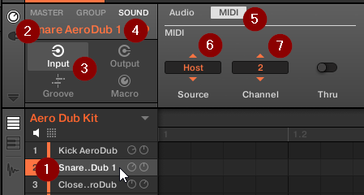
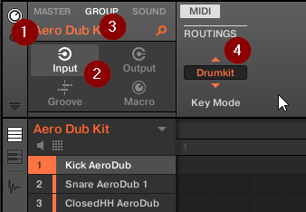

= Using Maschine 2 as VSTi in DAW

[TIP]
See link:using-battery.adoc[Using Battery] which may be simple and lighter
than using Maschine in the DAW.

Loading Maschine VSTi is as easy as with any other VSTi.
But how to play the whole kit and not just the selected sound?
There is a couple of options here:

* Playing the single sound!
This allows to change the pitch of the sound, so it may be interesting.
(If you don't want to play various pitches, you can also re-tune the single
sound to the specific pitch that is required.)

* Playing various sounds on various channels:
+

+
1. Click on the sound to select it.
2. Click on *Channel icon* on the left of the *Control area*.
3. Click on *Input* in the *Channel Property selector*.
4. Click *Sound* to operate only the selected sound.
5. Choose *MIDI*.
6. Switch *Source* to *Host*.
7. Choose the MIDI *Channel* for the sound.

* Playing various sounds with various notes:
+

+
1. Click on *Channel icon* on the left of the *Control area*.
2. Click on *Input* in the *Channel Property selector*.
3. Click *Group* to see the properties for the whole group (kit).
4. Switch *Key Mode* to *Drumkit*.

+
Now the keys from `C3` through `D#4` play the various sounds from the kit.

[WARNING]
If both *Sound* and *Group* settings are set simultaneously it can cause
triggering multiple sounds.
For *Drumkit* mode, change the *Source* for individual **Sound**s back to *Default*.
